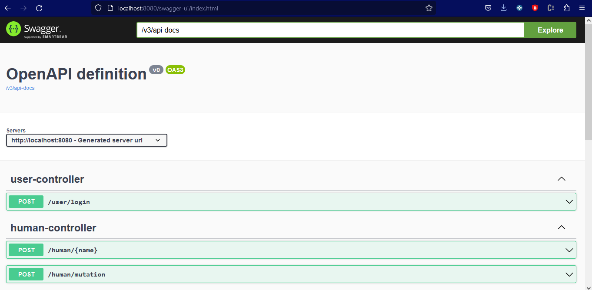

# BWL Mutation Test API

## Requerimientos

- Java 17
- Maven 3.2.5

## Pasos para instalacion

Validar instalacion de Java:
```
PS C:\Users\AylinR\Documents\Proyecto bwl\dna-mutation> java --version
openjdk 17.0.2 2022-01-18
OpenJDK Runtime Environment (build 17.0.2+8-86)
OpenJDK 64-Bit Server VM (build 17.0.2+8-86, mixed mode, sharing)
```

Validar instalacion de Maven:
```
PS C:\Users\AylinR\Documents\Proyecto bwl\dna-mutation> mvn --version
Apache Maven 3.9.2 (c9616018c7a021c1c39be70fb2843d6f5f9b8a1c)
Maven home: C:\Users\AylinR\Documents\Proyecto bwl\dna-mutation/apache-maven-3.9.2
Java version: 17.0.7, vendor: Oracle, runtime: /usr/lib/jvm/java-17-amazon-corretto.x86_64
Default locale: en_US, platform encoding: UTF-8
OS name: "linux", version: "5.10.157-139.675.amzn2.x86_64", arch: "amd64", family: "unix"
```

Clonar el repositorio y moverse a la ruta `adn-mutation-api`, dentro de ella ejecutar el siguiente comando:
```
mvn clean install
```

Si todo sale bien, ingresar a la siguente liga:
- [Swagger UI Localhost](http://localhost:8080/swagger-ui/index.html)

